# Curso-ML-Aplicado-Platzi

# **Introducción al curso de Machine Learning Aplicado con Python**

Bienvenidos al Curso de Machine Learning Aplicado con Python, en este curso veremos cómo utilizar Machine Learning con distintas librerías de Python. Particularmente estaremos utilizando Scikit-Learn, que es una de las más utilizadas de la industria.

En este curso también nos enfocaremos es en entender todo el flujo de trabajo que se hace cuando se resuelve un problema de Machine Learning.

Además de entender muy bien los algoritmos de Machine Learning que estaremos viendo, veremos otras disciplinas que son tanto o más importantes como el Feature Engineering y la selección de modelos.

---
Scikit-learn es probablemente la librería más útil para Machine Learning en Python, es de código abierto y es reutilizable en varios contextos, fomentando el uso académico y comercial. Proporciona una gama de algoritmos de aprendizaje supervisados y no supervisados en Python.
Este librería está construida sobre SciPy (Scientific Python) e incluye las siguientes librerías o paquetes:

NumPy: librería de matriz n-dimensional base
Pandas: estructura de datos y análisis
SciPy: librería fundamental para la informática científica
Matplotlib: trazado completo 2D
Ipython: consola interactiva mejorada
SymPy: matemática simbólica

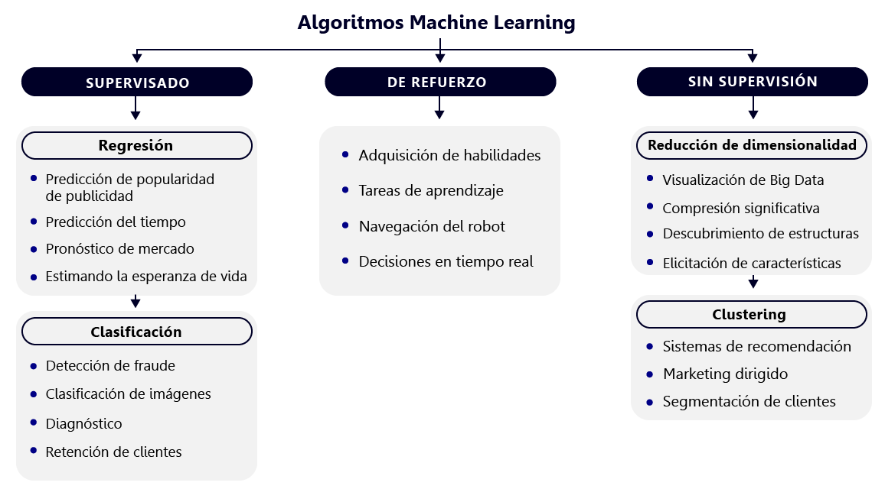

# **¿Cómo definir un problema de Machine Learning?**

## Por qué es tan importante definir el problema?
Errores comúnes:

* No tienes problemas por resolver
* Existian soluciones más simples
* No puedes medir el impacto de tu modelo
* No sabes si el problema ya ha sido resuelto
* El problema era imposible de resolver

-> Definir UN PROBLEMA REAL de tu empresa o aplicación, de forma clara y precisa, para saber si corresponde atacarlo con Machine Learning


**Preguntas clave por responder**

**Reconoce el tipo de aprendizaje que necesitas**

1. Qué beneficio piensas generar y para quién?

2. Cuál de los siguientes funcionalidades te sería más útil para lograr ese objetivo:

 * Predecir alguna métrica   (supervisado)
 * Predecir una etiqueta      (supervisado)
 * Agrupar elementos similares 
 * Optimizar un proceso con prueba y error

Los dos primeros corresponden a Aprendizaje supervisado. Nos enfocaremos en este ya que es el que está teniendo más impacto en la industria (cf. Andrew NG).

**Aterriza tu problema de aprendizaje supervisado**

1. Lo que quieres predecir es un valor de qué tipo?
 * Continuo
 * Discreto
2. Cuál es tu definición de éxito de una predicción?
3. Con qué datos contarías para hacer esta predicción?
4. La pregunta que estás tratando de resolver pertenece a alguna disciplina en particular?
5. Considerando tu intuición en la disciplina, crees que los datos te permitan predecir tu objetivo?

## Nuestro problema: Predicción de Ingresos de películas.

Contexto: Somos un ente gubernamental que quiere definir sus políticas de financiamiento de producciones cinematográficas nacionales.

**Reconoce el tipo de aprendizaje que necesitas**

1. Ayudar a la producción de peliculas de calidad que no logran ser autosustentables.
2. Nos sería útil saber que películas tienen más dificultad para recuperar en sus presupuestos. Por consiguiente queremos predecir una métrica: el ingreso mundial generado por una película.

**Aterriza tu problema de aprendizaje supervisado**

1. Los ingresos de una película corresponden a valores continuos.
2. Mi éxito será "qué tan cerca estoy del valor real de ingreso generado por la pelicula".
3. Me basaré en bases de datos públicas de internet
4. El dominio de trabajo es la industria del cine, en particular de la distribución de peliculas.
5. Sí, de forma general existen bastantes caracteristicas que me pueden ayudar a saber que película será exitosa como: calidad, actores, presupuesto, etc...

Resumen
* Quiero predecir ingresos de péliculas, para tomar mejores decisiones de financiamiento, con base a una regresión sobre datos de películas extraídos de internet.
* Mi evaluación del éxito será la precisión de mis predicciones.
* Podré apoyarme en conocimientos específicos de la industria.

## Terminología de Machine Learning

* Datos tabulares = Datos en dos dimensiones.
* Líneas = Ejemplos
* Columna = Feauture. Éstas son importantes porque nos van a ayudar a predecir cosas gracias a los modelos que usemos de Machine Learning.
* Cantidad de columnas = Dimensión de los datos
* Output de un algoritmo de Machine Learning (ML) = Modelo
* Variable objetivo = Target

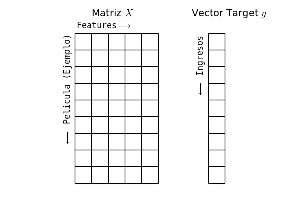


## El ciclo de Machine Learning

Muchas veces pensamos que hacer Machine Learning corresponde solamente a implementar un algoritmo de cualquiera de las librerías y con ello ya existe la solución a un problema. Pero en realidad existe todo un ciclo de trabajo donde los algoritmos de Machine Learning son solo una etapa, sin embargo, las demás etapas también son muy importantes y toman su tiempo para lograr los resultados que esperamos.

Hacer Machine Learning corresponde a trabajar en un ciclo, ir trabajando varias etapas e ir iterando.

**Ciclo de Machine Learning:**

* Definición del problema.
* Preparación de los datos.
* Representación de los datos.
* Modelamiento / Algoritmos de ML.
* Evaluación.

Este no es el final del proceso, se debe iterar hasta que en alguna de las iteraciones salga la solución al problema.

* Producción (Fin del proceso).

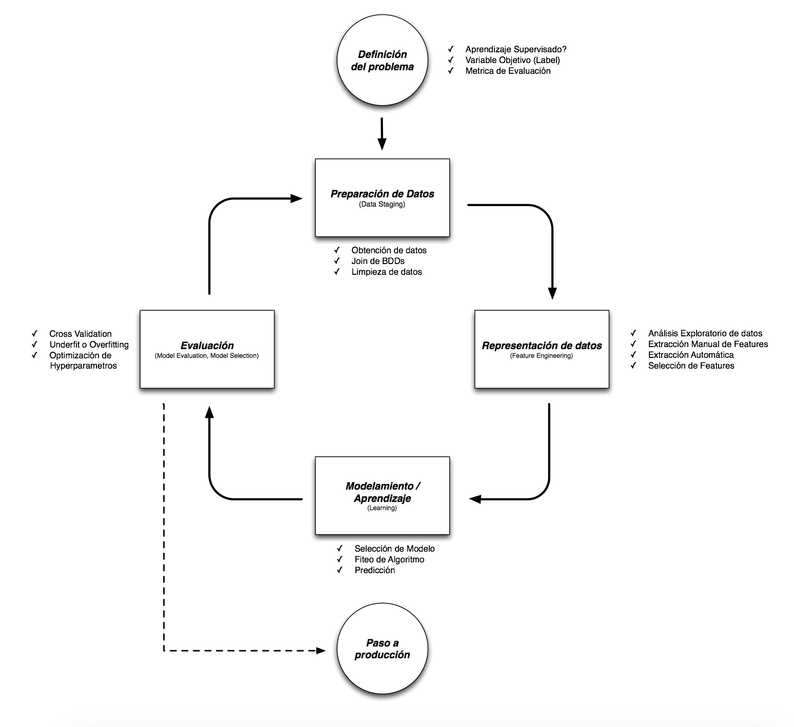


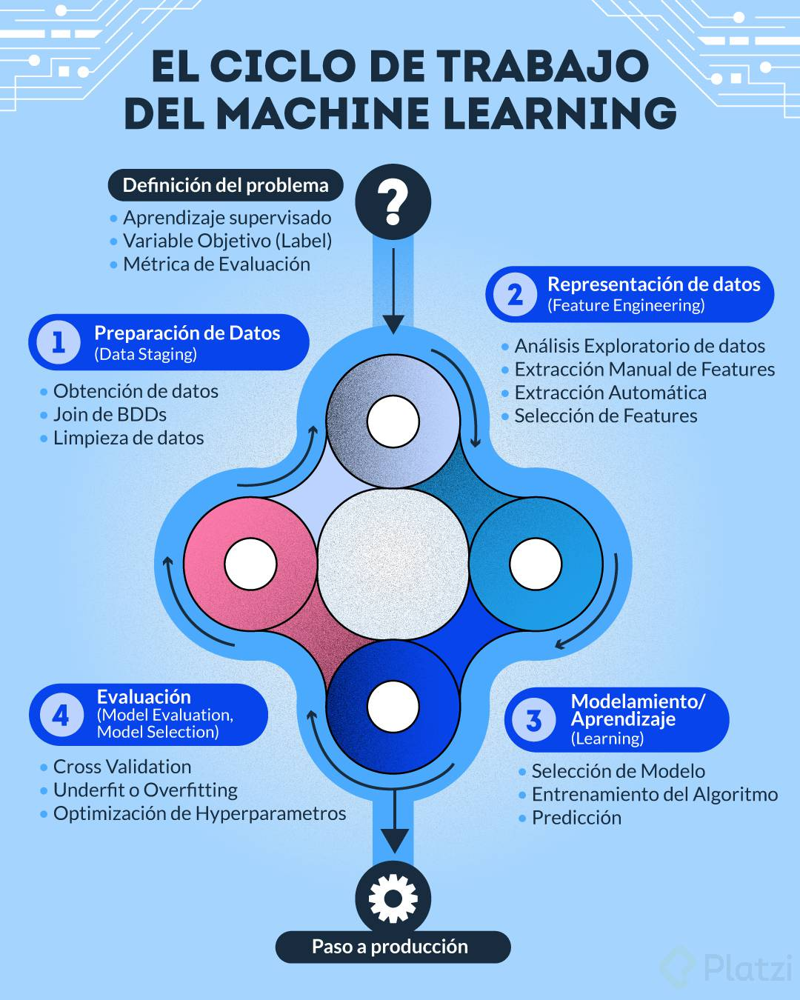

La navaja de Ockham o Principio de Parsimonia: La solución más simple casi siempre es la mejor.

scikit-learn.preprocesing = ayuda en feature engineering

scikit-learn.linealmodels = ayuda en los modelos

scikit-learn.modelselection = ayuda en la evaluacion

## Configuración del ambiente de trabajo con Google Collab


```python
import numpy as np
import pandas as pd
import matplotlib.pyplot as plt
import sklearn

import pandas as pd
pd.read_csv('https://github.com/JuanPabloMF/datasets-platzi-course/blob/master/datasets/peliculas.csv?raw=true')
```


## Qué es y cómo se utiliza Numpy

Datos importantes:

* Numpy es una librería muy importante para el ecosistema de Python ya que es la base de todos los cálculos científicos y muchas de las librerías de Machine Learning.
* Scikit-Learn con sus modelos, cuando retorna un resultado, en general lo retorna en un formato Numpy.
* La API de Numpy tiene muchas similitudes con Pandas.
* Numpy reemplaza de forma más eficiente lo que podría ser un tipo lista. En las listas podemos tener conjuntos de elementos numéricos. Sin embargo las listas no logran manejar datos de dos dimensiones.
* Las listas no poseen métodos que son prácticos para hacer aritmética.
* Es importante saber que otros lenguajes de programación poseen librerías altamente optimizadas para hacer cálculos numéricos con vectores de datos. Numpy es esa librería para el lenguaje de programación de Python.
* np.linspace es una función que permite crear un array de una dimensión de números entre 0 y 1.
* Los array a diferencia de otros objetos en Python están fuertemente tipificados. Esta tipificación fuerte es necesaria porque es una de las cosas que permite que esta librería sea más rápida que ocupar listas, por ejemplo.

**Porque Numpy?**

* list no tiene buen manejo para los indices cuando se trabaja con listas de datos de más de dos dimensiones.
* list no posee metodos de algebra lineal, ni de transformaciones de datos.
* En otros lenguajes encontramos estructuras de datos altamente optimizadas para poder hacer operaciones algebraicas sobre arrays.

Por sobre Numpy se erige todo un ecosistema de librerias muy utiles que iremos viendo en el recorrido de este curso.

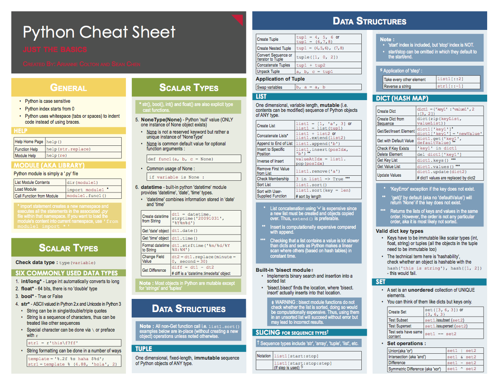

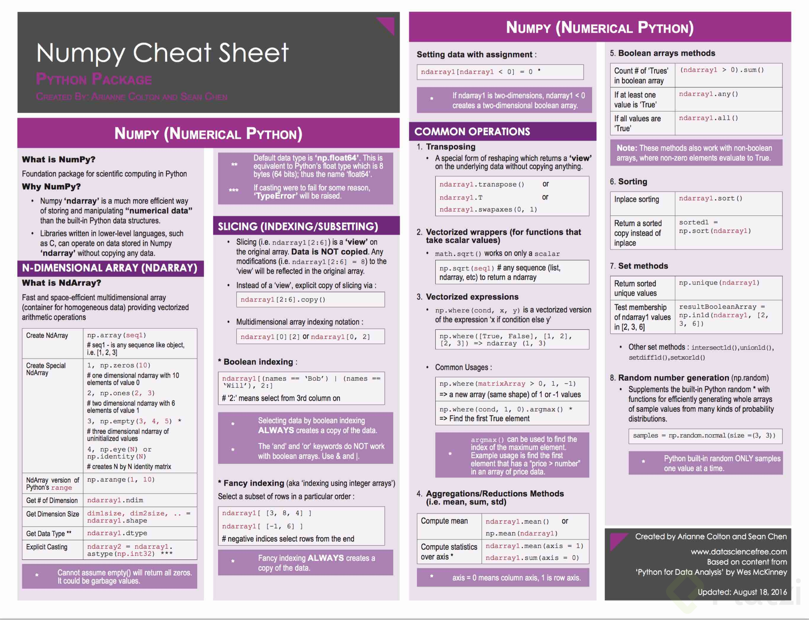


Numpy puede hacer broucasting : que es multiplicar matrices de diferentes dimesiones y lo hace así


# Preparación de los datos

## Cargar los datos necesarios

pd.read_csv es el metodo que nos permite importar los datos desde un CSV y cargarlo en un **DataFrame**, que es la estructura de base de Pandas


Un dataframe es una estructura de datos que se compone de los elementos siguientes

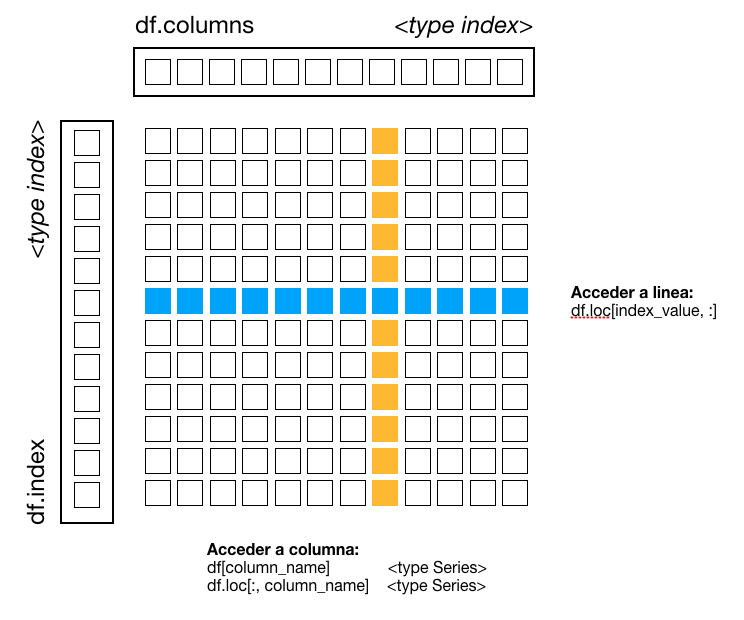


## Intentemos inspeccionar nuestros datos y entenderlos mejor

A diferencia de Numpy, Pandas permite cargar no solo datos numericos pero tambien **datos de texto** que vemos por ejemplo en las columnas de actores y **mezclar distintos tipos de datos**.
* int64 y float64 corresponden a los mismos dtypes de Numpy
* object es el dtype que permite manejar datos de texto


Método describe(): Para cada columna, da todas las propiedades estadísticas si es una columna numérica, si hay alguna de texto entre las numéricas nos daría menos información.

Este método nos da información sobre:
Count: cantidad de información
Mean: Promedio
Std: Desviación estándar
Min: mínimo
25%, 50%, 75% son los cuartiles
Los cuartiles son valores que dividen una muestra de datos en cuatro partes iguales
25% de los datos es menor que o igual a este valor.
La mediana. 50% de los datos es menor que o igual a este valor.
75% de los datos es menor que o igual a este valor.
Max: máximo


```python
# Estadísticas de las columnas númericas
movies_num.describe()
```


```python
# Estadísticas de las columnas de texto
#Para hacer nuestro primer modelo más simple para este trabajaremos solo con las columnas númericas.
```


Para poder debuggear esta situación utilizaremos una tecnica muy tipica de pandas que se llama **boolean filtering**. Basicamente construimos una serie de booleanos con el mismo indice que nuestro dataframe (la serie clasicamente la llamaremos mask).


Tenemos un problema de limpieza de los datos. La BDD fue creada sin diferenciar:

* La moneda en la que se ingresaba el presupuesto y el ingreso.
* La zona (país/mundial) en la que se registro el ingreso

## Limpiar los datos

En principio habría que hacer el scraping de nuevo, pero se tiene esto:

Importar BBDD thenumbers.com## Ahora manejaremos los datos faltantes (nulos o NaN). 


```python
financials = pd.read_csv('https://github.com/JuanPabloMF/datasets-platzi-course/blob/master/datasets/thenumbers.csv?raw=true',encoding='utf-8')
financials.head()
```


```python
#Sacamos las columnas que nos interesan y  luego hacemos un merge
financials = financials[['movie_title','production_budget','worldwide_gross']]
print(financials.shape)
print(movies.shape)
#vemos que hay menos datos, es decir vamos perder 700 datos, pero es mejor tener datos de calidad que datos sucios, si fuera un 50% sería más dramatico
```

    (4341, 3)
    (5043, 19)


```python
#Antes del merge necesito darle la columna de 'title' al df financials
movies_num = pd.concat([movies_num, movies['movie_title']],axis=1)
movies_num .head()

```


```python
#luego si el merge
movies_v2 = pd.merge(financials,movies_num,on='movie_title',how='left')
```


```python
gross_opening = pd.read_csv('https://github.com/JuanPabloMF/datasets-platzi-course/blob/master/datasets/opening_df.csv?raw=true',encoding='utf-8')
gross_opening = gross_opening.drop('Unnamed: 0',axis=1)

```


```python
movies_v2 = pd.merge(movies_v2,gross_opening,on='movie_title',how='left')
movies_v2.shape
```


## Manejo de datos faltantes

**Ahora solucionaremos el problema de los datos faltantes (nulos o NaN).**

Los datos faltantes generan problemas con muchos algoritmos de ML. Es por esto que existen distintas estrategias para lidiar con ellos.


 
```python
movies_v2.notnull().apply(pd.Series.value_counts)
```


```python
(movies_v2 != 0).apply(pd.Series.value_counts)
```


```python
available = ((movies_v2 != 0) & (movies_v2.notnull()))
```


```python
available.all(axis=1).value_counts()
```


No podemos entrenar nuestro algoritmo con datos cuya variable objetivo no esta definida o sea nula (valor falso). Eliminemos esas líneas.


```python
mask = available['worldwide_gross']
movies_v2 = movies_v2[mask]
((movies_v2 != 0) & (movies_v2.notnull())).worldwide_gross.value_counts()
```


En el caso de las features que no son la variable objetivo una mejor solución para lidiar con los datos faltantes es remplazar estos datos por otros que sean manejables y no afecten la calidad de las predicciones. La estrategia más comun es utilizar la media de todos los ejemplos para la feature dada.


En el caso de las featrures que no son la variable objetivo una mejor solucíon para lidiar con los datos faltantes es reemplazar estos datos por otros que sean manejables y no afecten la calidad de las predicciones. La estrategia más comun es utilizar la medida de todos los ejemplos para la feature data


```python
from sklearn.impute import SimpleImputer
imputer = SimpleImputer(missing_values=np.nan, strategy='mean')
```


Para los que usan colab y quieren guardar el archivo:

from google.colab import files
X.to_csv('x.csv',index=False)
files.download('x.csv')


```python
from sklearn.impute import SimpleImputer
imputer = SimpleImputer(missing_values=np.nan, strategy='mean')
values = imputer.fit_transform(movies_v2)
X = pd.DataFrame(values)
X.columns = movies_v2.columns
X.index = movies_v2.index
X.head()
```


# Modelación y Evaluación

## El objeto estimador de Scikit-Learn

Datos importantes:

Por como fue diseñado Scikit-Learn, existe una API muy fácil de ocupar y muy unificada. Esta unificación se da por un objeto que se llama “estimador” que tiene en todos los casos y para el algoritmo de Machine Learning que sea, una API que es común y 3 métodos que son clave.
Scikit-Learn posee muchos modelos, se pueden implementar tanto, regresiones lineales como regresiones regularizadas, árboles de decisión, SDMs, etc.
Scikit-Learn contiene todos los modelos que son usados hoy en día, y una de las virtudes de esta librería es que sigue muy de cerca lo que pasa en la investigación.
Scikit-Learn es la librería más usada de Machine Learning General, no de Machine Learning Especializado, para ello está la librería de Tensor Flow y sirve casi exclusivamente para modelos de Deep Learning.


Scikit-learn es la librería más usada de Machine Learning tradicional [Ver ranking de Github](https://github.com/showcases/machine-learning). La librería incluye funcionalidades de:

* Preprocesamiento de datos en  sklearn.preprocessing 
* Algoritmos de Machine Learning en sklearn.linear_model, sklearn.svm, sklearn.ensemble, y muchos más.
* Evaluación de modelos en sklearn.model_selection y sklearn.metrics


Scikit-learn sigue muy de cerca los resultados de la investigación e implementa los resultados más maduros y probados en sus modulos. La [documentación](http://scikit-learn.org/stable/modules/ensemble.html#forests-of-randomized-trees) extensa muestra como la librería es un compendio de conocimiento en Machine Learning llevado a software


Una estructura de datos esencial en scikit-learn es el Estimator

Los 3 métodos mas importantes del Estimador son:

* Fit: Entrena el modelo.
* Predict: Predice valores, con datos nuevos.
* Score: Mide el performace del algoritmo y nos indica una probabilidad.

* Los datos de entrenamiento se deben separar, dependiendo de la cantidad de datos se toma un porcentaje para entrenar(70%-80%) y otro para hacer test. Ésta operación entrega 4 salidas -Datos de entrenamiento, target de entrenamiento, datos de test y target de test-
* fit: Entrenar un modelo, se necesitan datos de entrenamiento (matriz), los datos o valores(vector) objetivos (target).
* Predict: Método para obtener predicciones del modelo ya entrenado, ingresa un valor nuevo y predice una salida.
* Score: con los datos de test podemos obtener una métrica de performance.

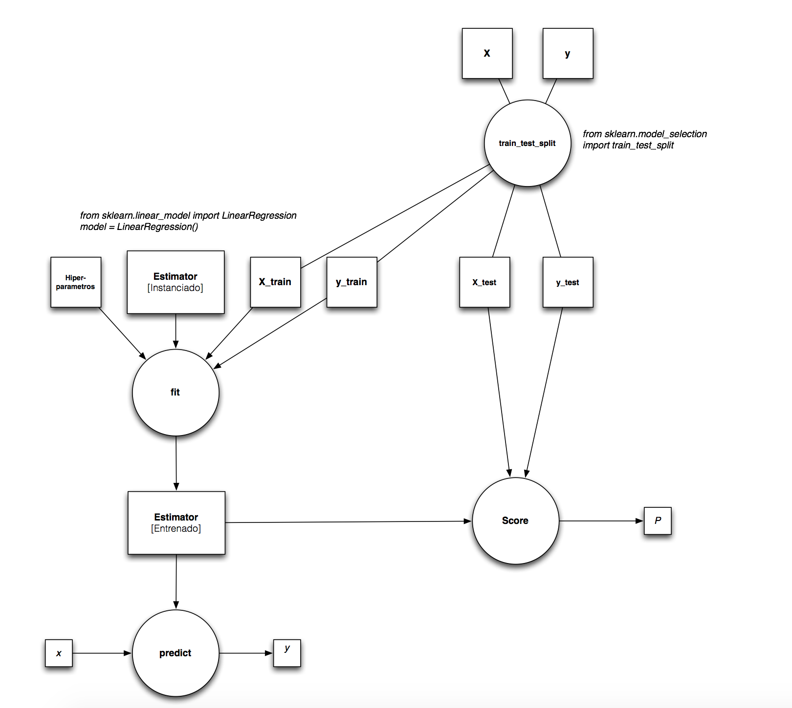

**Para poder escoger el estimator apropiado una excelente guia es el cheatsheet siguiente, hecho por uno de los core-dev de scikit-learn.**


### Implementemos un modelo simple de regresión primero


```python
y = X['worldwide_gross']
```


```python
x = X.drop('worldwide_gross',axis=1)
```


```python
from sklearn.model_selection import train_test_split

x_train, x_test, y_train, y_test = train_test_split(x,y,test_size=0.4,random_state=11)
print(len(x))
print(len(x_train))
print(len(x_test))
```

    4104
    2462
    1642


```python
from sklearn.linear_model import Lasso

model = Lasso()
model.fit(x_train,y_train)
```


    Lasso(alpha=1.0, copy_X=True, fit_intercept=True, max_iter=1000,
          normalize=False, positive=False, precompute=False, random_state=None,
          selection='cyclic', tol=0.0001, warm_start=False)


```python
predicted = model.predict(x_test)
predicted.shape
```


    (1642,)


```python
import matplotlib.pyplot as plt
plt.hist([predicted,y_test]);
```


    

    


Este es un primer indicador de que el entrenamiento estuvo bien, pero necesitamos hacer cosas más finas.

La grafica esta graficando lo predecido contra el grupo de test

## Ajustando Modelos de Machine Learning, Underfitting y Overfitting

* Unferfitting (Subajuste) Se presenta cuando un modelo no puede capturar la tendencia de los datos. Es generalmente el resultado de un modelo extremadamente simple.

* Overfitting (Sobreajuste) Se presenta cuando un algoritmo está perfectamente adaptado a los datos con los que lo entrenamos, pero si trataran de predecir nuevos datos, lo más probable es que nos de error.


Entre los modelos matemáticos que existen, el polinómico es el que mejor se adapta a tendencias de datos extrañas sin embargo, hay que tener cuidado de usar más del tercer orden polinómico.

Lo que buscamos : **Queremos un error de entrenamiento bajo, un error de test bajo y la diferencia entre los dos errores también debería ser bajo.** Se busca un polinomio no tan basico ni tan complejo.

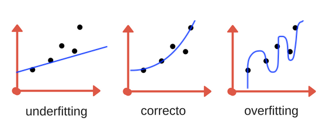

La linea azul es nuestro modelo de predicción y los puntos son los datos. 

Podemos ver graficamente lo que significan el sobre y el sub ajuste.

Es decir, cuando el modelo es muy simple tenemos subajuste y cuando el modelo es muy complejo tenemos sobreajuste, cuando el modelo es muy complejo tiende a generalizar los errores que hay.

To reduce underfitting:

1. Increase model complexity
2. Increase number of features, performing feature engineering
3. Remove noise from the data.
4. Increase the number of epochs or increase the duration of training to get better results.

To reduce overfitting:

1. Increase training data.
2. Reduce model complexity.
3. Early stopping during the training phase (have an eye over the loss over the training period as soon as loss begins to increase stop training).
4. Ridge Regularization and Lasso Regularization
5. Use dropout for neural networks to tackle overfitting.

## Evaluando el modelo 
 
**Evaluemos de forma más fina el comportamiento de nuestro modelo**

Los estimadores y las funciones de sklearn vienen con el máximo de argumentos con valores por defecto que suelen ser las mejores opciones si no tenemos algun conocimiento particular el problema. En este caso particular la función estimator.score ya viene con una de las métricas de sklearn.metrics, que es la métrica sklearn.metric.r2_score


El score R2 de una regresión es una de las formas más comunes de entender su poder predictivo. Este mientras más cerca de 1 este, mejor es


Los valores que puede tomar son de -infinito hasta 1. Un score R2 negativo es malo, ya que esto indica que la regresión es peor que si simplemente eligieramos un valor fijo como predicción para todos los puntos, la media.


```python
model.score(x_test,y_test)
```


    0.6726448584346796


Un buen score R2 es importante para una regresión. Pero no lo es todo. De forma general los scores hay que complementarlos con visualizaciones de los datos ya que una métrica no logra siempre encodear todas las caracteristicas de una distribución de probabilidades. Un ejemplo es el siguiente:


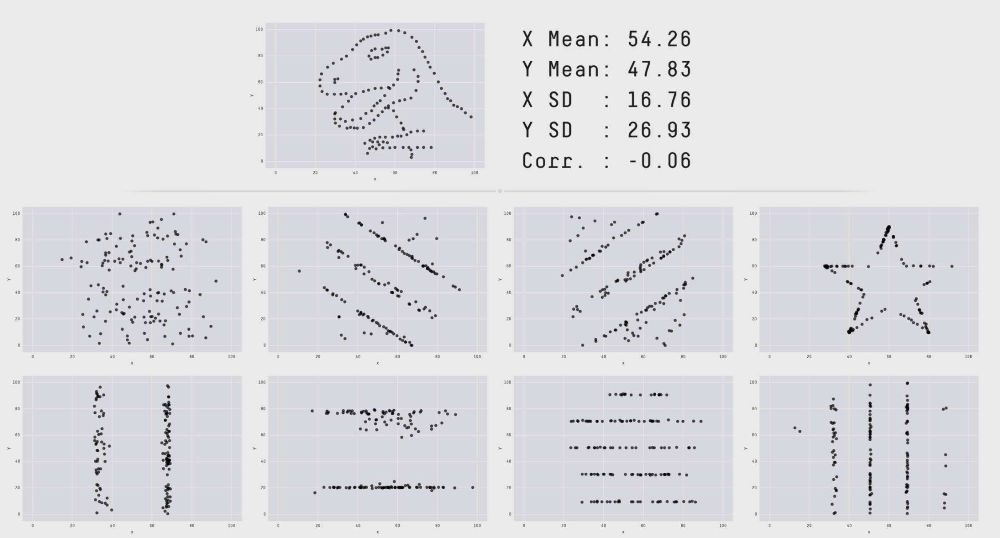

**Siempre visualiza tus resultados**, aunque tengas un buen score de performance.


Si no hay patrones está bién


    


    


Vamos a hacer una evaluación numérica de los error, graficando la función acumulativa de la distribución de los errores.


Cuando el profesor usa “lap_residuals = np.log(ap_residuals)”, está usando la función logaritmo natural. Sin embargo, cuando hace el análisis de histograma acumulado plt.hist(lap_residuals,bins=100, normed=1, histtype=‘step’, cumulative=True), lo hace como si fuera un logaritmo en base 10 y por eso dice que los y_test con un error residual menor al 10%(0.1 en decimal o -1 en escala logarítmica) corresponde al 40% de los datos. Pero, realmente el logaritmo natural de 0.1 (10% de error) es -2.30259, lo que quiere decir que incluso mucho menos del 40% de los y_test tienen un error menor al 10%.


---

Para quienes tengan dificultad en seguir los datos que el profesor interpreta gráficamente, la clave está en saber en que rango es bueno que se mueva el R, si el R es negativo significa que es mejor usar un modelo mas simple(la media), y si es cero significa que es lo mismo usar el modelo mas simple (la media), como la idea es usar algo mejor que la media significa que debemos estar por arriba de cero, pero tampoco mucho, lo ideal es que todos los valores esten mayores a 0 e iguales o menores a 1, siendo lo mejor que esten mas concentrados cerca de 1, basicamente si el error es cero nuestro error es de 100% porque no es mejor que la media, si es negativa ya seria mas del 100%, y si tambien es mayor a 1 tambien es un error superior a 100%

Espero sirva esta información.

Super importantísimo a la hora de evaluar nuestros modelos y no limitarnos solamente a un buen score.

Como complemento y para reforzar un poco la parte de los residual plots, dejo este extracto de un artículo de Towards Data Science. Tocará investigar más sobre la Función cumulativa de los errores (Si alguien tiene una buena referencia que aportar, agradecería muchísimo que lo dejaran en el comentario de este post).

📌 Características de un buen residual plot

 * Tiene alta densidad de puntos cercanos al origen y baja densidad de puntos alejados del origen.
 * Es simétrico en el origen.

Ejemplo:

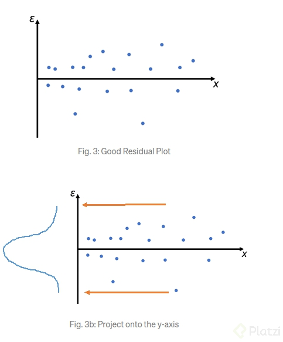


 * Otra razón por la cual este gráfico es un buen residual plot es porque independientemente del valor de una variable independiente (eje x), los errores residuales se distribuyen aproximadamente de la misma manera (distribución normal) y no vemos ningun patrón en los valores.


Por otra parte, el siguiente gráfico no es un buen residual plot al no cumplir con las condiciones mencionadas,

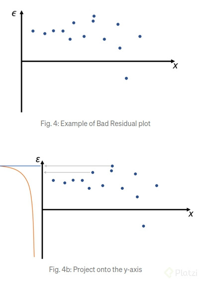

Referencia:

* Alta densidad de puntos lejos del origen.
* Al proyectar los puntos en el eje Y, no se tiene una distribución normal.

Referencia:
[How to use Residual Plots for regression model validation?](https://towardsdatascience.com/how-to-use-residual-plots-for-regression-model-validation-c3c70e8ab378)

# Feature Engineering

## Feedback del modelamiento

El diseño de las features puede ser más importante que la optimización del modelo de ML, 

Mejorar la performance de nuestros modelos no solo pasa por optimizar sus parametros.
Una de las partes clave, y según algunos expertos la más importante, es la de **diseñar la representación en la que se entregan los datos a los modelos** para que estos los procesen.
Esto equivale, en palabras más simples, en definir de forma inteligente las features (columnas) de nuestras tablas de datos.

**Ejemplo de feature engineering:**

El problema:

Supongamos que estamos tratando de resolver el problema siguiente.

* Tenemos un problema de reconocer si ciertos datos con una sola feature son de una clase 1 o de una clase 2 (por ejemplo "el producto esta deficiente" o "el producto esta funcional").
* Por lo tanto estamos resolviendo una **clasificación.**
* Para esta clasificación decidimos tomar un SVM, que es un modelo poderoso que funciona buscando la "mejor" recta que separa los puntos de cada clase.


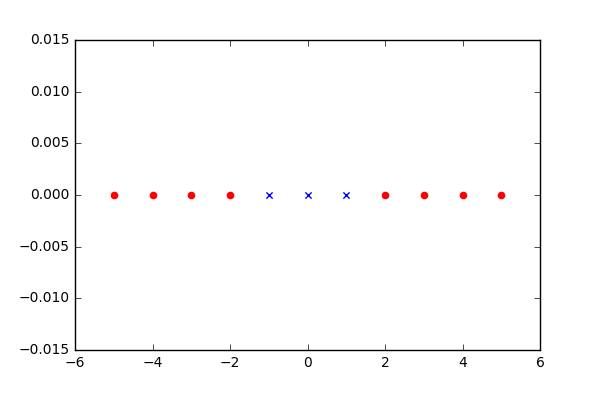

Como podemos ver no existe un separador óptimo. Debemos para resolver el problema buscar un modelo aún más poderoso? No necesariamente.

Agregemos una nueva feature:
$X[columna_2]=X[columna_1]^2$

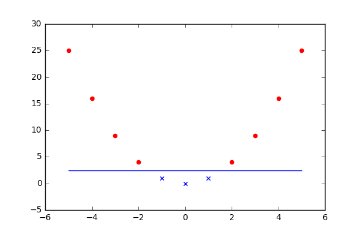

Claramente con esta nueva feature vemos que existe una recta que separa los espacios de puntos.
Esta recta tendra un score ampliamente mejor que cualquier solucion al primer problema.

---
**Importante!**

Quiero hacer algunos aportes que me di cuenta en el estudio del video.

1. Cuando se construyó X en videos anteriores, al momento de hacer el merge, tambien se creó una columna llamada gross y cuando se guardó esta columna estaba presente, por lo que cuando se carga X además de hacer el drop de worldwide_gross también se debe hacer el drop de gross; extrañamente el X que el profesor carga en el video no trae esta columna gross incluida ya que no le hace drop posteriormente, pero para poder entrenar el modelo en las mismas condiciones que debemos hacer del drop de gross, si cuando ejecutas len(model.coef_) y te da 8 es porque no has hecho el drop aún
2. Lo que dice el profesor mas adelante (minuto 6:46 al 6:50) hace referencia a que el modelo (Lasso) escoge segun sus criterios internos cuales features son mas importantes segun los datos que tiene, como los datos son aleatorios, cada modelo(osea el codigo de cada alummno que lo corre) puede escoger importancias diferentes, por lo que no te preocupes si tu grafica es o no igual a la del profesor, puede que tus datos sean muy parecidos a los que el tenia y la grafica salga igual o puede que no y que la grafica sea diferente, pero si preocupate si en lugar de 7 features tienes 8 porque eso significa que no dropeaste gross.
3. En el primer pairplot(que solo es en azul), en la diagonal siempre va haber un un grafico de barras ya que con si misma cada features muestra como esta distribuida (el punto 1 que menciona sobre los metodos de visualización) y en los otros casos (los scatters) muestra es la correlacion con las otras variables, especialmente con la variable objetivo(worldwide_gross), esta última linea es la clave para entender el video al final, ya que como analiza y concluye que production_budget y imdb_score son las variables mas informativas al final es solo se enfoca en esas dos; un dato curioso es que en mi modelo ademas de las variables mencionadas tambien title_year tenia una correlacion tambien grande con la variable objetivo.
4. Al aplicar pandas.cut esta buscando una manera de ‘‘organizar’’ sus datos con el fin de que mas adelante la visualización de los colores sea facil de realizar, aunque me queda la duda si eligio production_budget por estar correlacionada con la variable objetivo o funcionaria igual elegir cualquier otra variable que sea facil de segmentar como budget o incluso el imdb score que tendria una manera de segmentar mucho menor y mas facil.
5. Recordemos que en el segundo pairplot (el coloreado) el se enfoca solo en las dos variables que tienen mas correlacion con la variable objetivo, las cuales son production_budget y imdb_score, pero en esta ocasión el busca analizar si separando los datos bajo un criterior especifico que es el production_budget (en el primer pairplot no distinguia esto por eso las graficas son diferentes tambien de forma y no solo color) sigue teniendo validez la idea de elegir estas dos variables, dado que sigue existiendo correlacion entre esas y la separacion segun la categoria que eligio (esto se ve porque hay una diagonal y a su vez no hay mezclas de colores), concluye que estas dos variables son imporantes e imagino que en los videos posteriores va a centrar el analisis de su modelo en estas dos variables, de hecho cuando hagas el ejercicio puedes ver que para tu modelo tambien hay variables que tienen correlacion entre si y con la categoria pero si no tienen correlacion con la variable objetivo es mejor descartarlas, en mi caso title_year aunque tenia correlacion con la variable objetivo, su correlacion en base a la categoria no tiene relacion lineal y ademas no esta separada, entonces la descarte y llegue a la misma conclusion que el profesor, esa debe ser la conclusion a la que debes llegar, que estas dos variables son las variables informativas
---

**Principios de diseño de Features**
---

Diseñar tus features es un arte más que una ciencia (por lo que en general te recomendamos ganar experiencia leyendo articulos cientificos y viendo soluciones
* **Features Informativas:** Tus features son más utiles mientras más correlación tengan tu variable objetivo.
* **Features Independientes:** Para no tener redudancias tus features deberían ser lo más independientes posible entre ellas.
* **Cantidad de Features controlada:** Nuestra intuición nos falla en dimensiones superiores a 3 (ver video maldicion de la dimensionalidad). En la mayoría de los casos aumentar la cantidad de features afecta negativamente la performance si no contamos con una gran cantidad de datos. Por ultimo pocas features aseguran una mejor interpretabilidad de los modelos

Ejemplo de Feature informativa y Feature no informativa

Predecir el **precio de una casa** en **función de sus metros cuadrados**.

Predecir el **precio de una casa** en **función de la temperatura del mar**.

Es importante entender la correlación entre la feature y la variable objetivo. Más sobre esto en los siguientes videos.

**Visualizar interdepencia entre variables**


```python
import seaborn as sns
#%matplotlib inline 
# X.corr()
# colormap = sns.cubehelix_palette(as_cmap=True, reverse=True)
colormap = sns.cm.rocket_r
sns.heatmap(x.corr(), cmap=colormap)
```


    <matplotlib.axes._subplots.AxesSubplot at 0x7f9bd2d95b50>


    

    


**La maldición de la dimensión**

Datasaurus Dozen y Anscombe's quartet:

Utilidad de la capacidad de entender los datos en 1, 2 y 3 dimensiones del ojo humano.

Maldición de la dimensionalidad:

En **dimensión superior o igual a 4**, nuestra capacidad de entender los datos se pierde, **y aún peor fenomenos extraños/contraproducentes ocurren**

**Ejemplo 1**

Que largo debe tener cada arista de un hypercubo de dimension p que capture 10% del volumen de un hypercubo de volumen 1 que lo contiene?

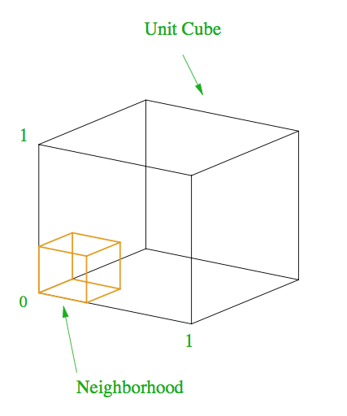

$V_{hypercubo}=a^p\ y\ si\ V_{hypercubo}=0.1⟹a=0.1^{1/p}$


```python
import matplotlib.pyplot as plt
import numpy as np

x = np.arange(1,15)
y = np.power(0.1,1/x)
plt.plot(x,y)
```


    [<matplotlib.lines.Line2D at 0x7f9bd2bdd2d0>]


    

    


**En dimensión 10:** Necesitamos un hypercubo que cubra 80% de cada una de las aristas para solamente obtener 10% del volumen!

---
En alta dimensión es muy poco probable que tus ejemplos cubran todo el espacio de forma densa.
Por ende en **alta dimensión necesitas una cantidad de datos que crece exponencialmente para poder entrenar tus modelos**.
Te recomendamos tener cuidado al aumentar la dimensión de tus datos, no esta prohibido, pero hacerlo de forma exagerada te puede llevar hacia estos problemas.

## Analisis exploratorio

**Feedback de tus modelos**

Ciertos modelos como la regresión o los arboles se dicen **"interpretables"**. Esto quiere decir que de los resultados de los modelos podemos sacar conclusiones o **"insights"**.

En particular la regresión Lasso es interpretable:

* mientras más grande el coeficiente para una feature, más relevante es esta para la regresión.
* la regresión Lasso trata de seleccionar un pequeño número de features relevantes.


 Feedback del modelo

* model.coef_ --> parámetros de la regresión lineal. Coeficientes por los que son multiplicados cada feature.
* Al observar el orden de magnitud de cada parámetro se pueden obtener las features más importantes para el modelo.
* Lo anterior puede indicarnos con que sub conjunto features trabajar si se desea reducir la dimensionalidad de los datos.

🔹 Correlación entre variables

📌 Reminder: Lo ideal es que las features sean independientes entre sí y no tengan correlación entre ellas, y por otra parte que las features tengan correlación con la variable objetivo, es decir que sean features informativas.

Para poder verificar esto se utilizan técnicas de visualización de datos, entre ellas, pairplot. En pairplot los graficos diagonales representan una distribución probabilística mientras los graficos que estan fuera de la diagonal son scatterplots y son útiles para identificar correlaciones.

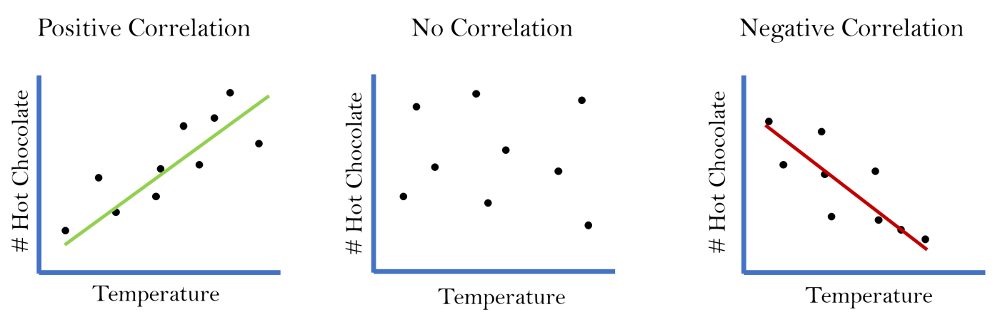


```python
from sklearn.linear_model import Lasso

model = Lasso()
```


```python
from sklearn.model_selection import train_test_split

X_train, X_test, y_train, y_test = train_test_split(x,y)
```


```python
len(X_train)/len(x)
```


    0.75


```python
model.fit(X_train,y_train)
```

    /usr/local/lib/python3.7/dist-packages/sklearn/linear_model/_coordinate_descent.py:476: ConvergenceWarning: Objective did not converge. You might want to increase the number of iterations. Duality gap: 2.2323564950330614e+18, tolerance: 9327308305132672.0
      positive)


    Lasso(alpha=1.0, copy_X=True, fit_intercept=True, max_iter=1000,
          normalize=False, positive=False, precompute=False, random_state=None,
          selection='cyclic', tol=0.0001, warm_start=False)


```python
model.score(X_test,y_test)
```


    0.5616501557067224


```python
model.coef_
```


    array([ 3.11981902e+00,  7.30756463e+04, -9.85674662e+06, -1.70356987e+05,
            9.61868790e+01, -1.15014726e-02,  2.93563829e+07])


```python
var = np.floor(np.log10(np.abs(model.coef_)))
```


```python
plt.rcParams["figure.figsize"] = [12,8]
plt.plot(var)
plt.xticks(np.arange(7),list(x.columns));
```


    

    


Esto nos guía a guardar únicamente:

* production_budget
* title_year
* duration
* cast_total_facebook_likes
* imdb_score

**Correlación de Variables**


```python
import seaborn as sns
import pandas as pd

Z = pd.concat([x,y],axis=1)
# sns.pairplot(Z)
```


```python
clase = pd.cut(x['production_budget'],8).cat.codes.rename('class')
Z2 = pd.concat([x,clase],axis=1)
```


```python
Z3 = pd.concat([x,y],axis=1)
sns.heatmap(Z3.corr())
```

    


De esto concluimos, sin sorpresa, que son muy importantes:

* production_budget
* imdb_score

**Metodos de selección automatica de features**

Sklearn posee una serie de métodos para seleccionar las mejores features. Estos métodos los puedes encontrar en sklearn.feature_selection


```python
from sklearn.feature_selection import SelectKBest
from sklearn.feature_selection import mutual_info_regression

selector = SelectKBest(mutual_info_regression, k=4)
selector.fit(x,y)
```


    SelectKBest(k=4, score_func=<function mutual_info_regression at 0x7f9bd387d5f0>)


```python
scores = selector.scores_
plt.rcParams["figure.figsize"] = [12,8]
plt.plot(scores)
plt.xticks(np.arange(7),list(x.columns));
```


    

    


Del analisis univariante obtenemos que las mejores features son:

* production_budget
* cast_total_facebook_likes
* budget

Guardaremos las 5 features entregadas por la interpretación de nuestra regresión Lasso


```python
X2 = x[['production_budget','title_year','duration.1','cast_total_facebook_likes','imdb_score']]
X3 = x[['production_budget','cast_total_facebook_likes','imdb_score']]
```

**Veamos los resultados del modelo con estas features**


```python
X_train, X_test, y_train, y_test = train_test_split(x,y)
```


```python
cols2 = ['production_budget','title_year','duration.1','cast_total_facebook_likes','imdb_score']
X2_train, X2_test, y2_train, y2_test = X_train[cols2], X_test[cols2], y_train, y_test

cols3 = ['production_budget','cast_total_facebook_likes','imdb_score']
X3_train, X3_test, y3_train, y3_test = X_train[cols3], X_test[cols3], y_train, y_test
```


```python
from sklearn.linear_model import Lasso

model1 = Lasso()
model2 = Lasso()
model3 = Lasso()

model1.fit(X_train,y_train)
model2.fit(X2_train,y2_train)
model3.fit(X3_train,y3_train)
```

    /usr/local/lib/python3.7/dist-packages/sklearn/linear_model/_coordinate_descent.py:476: ConvergenceWarning: Objective did not converge. You might want to increase the number of iterations. Duality gap: 6.377512964849066e+18, tolerance: 9213994736252264.0
      positive)
    /usr/local/lib/python3.7/dist-packages/sklearn/linear_model/_coordinate_descent.py:476: ConvergenceWarning: Objective did not converge. You might want to increase the number of iterations. Duality gap: 5.669662555828392e+18, tolerance: 9213994736252264.0
      positive)
    /usr/local/lib/python3.7/dist-packages/sklearn/linear_model/_coordinate_descent.py:476: ConvergenceWarning: Objective did not converge. You might want to increase the number of iterations. Duality gap: 1.7227280924893635e+18, tolerance: 9213994736252264.0
      positive)


    Lasso(alpha=1.0, copy_X=True, fit_intercept=True, max_iter=1000,
          normalize=False, positive=False, precompute=False, random_state=None,
          selection='cyclic', tol=0.0001, warm_start=False)


```python
print(model1.score(X_test,y_test))
print(model2.score(X2_test,y2_test))
print(model3.score(X3_test,y3_test))
```

    0.5744014760571194
    0.572714346382617
    0.573515246009694


### Creación de features
**Escalamiento de los datos**

Diversos algoritmos son sensibles a la escala en la que viene cada feature. **Re-escalarlos** puede traer significativas mejoras de rendimiento.

Existen distintas estrategias de escalamiento de tus features, pero la más común es la estandarización donde convertimos la variable para que la distribución de esta siga una distribución que es Gaussiana de media 0 y de desviación estandar 1.

---
Lo que el profesor está haciendo con la transformación de features se llama “interacción de variables” y en ocasiones eso genera mejores resultados en una regresión. Por ejemplo la venta de una casa depende del precio, pero también depende de su tamaño, entonces la interacción entre precio y tamaño suele expresarse como una multiplicación entre los valores de cada observación y ese nuevo resultado se vuelve una variable de interacción.


```python
from sklearn.model_selection import train_test_split
y = X['worldwide_gross']
x = X.drop('worldwide_gross',axis=1)
X_train, X_test, y_train, y_test = train_test_split(x,y)
```


```python
from sklearn.preprocessing import StandardScaler

scaler = StandardScaler()
scaler.fit(X_train)
```


    StandardScaler(copy=True, with_mean=True, with_std=True)


```python
scaler.mean_
scaler.scale_
scaler.transform(X_train)
```


    array([[-7.86577370e-01,  2.36982858e-01,  2.67169328e-01, ...,
            -5.44958902e-01,  1.67864328e-03,  6.87710517e-03],
           [-7.71265953e-01, -5.34138321e+00, -9.56723553e-01, ...,
             1.43275451e+00,  1.67864328e-03,  6.87710517e-03],
           [ 7.35054108e-01, -2.62572313e-01,  2.67169328e-01, ...,
             2.18616914e+00, -3.92090348e-01, -3.08924198e-01],
           ...,
           [-5.13159214e-01, -1.27947274e-02,  2.67169328e-01, ...,
            -1.01584305e+00, -4.80677585e-01,  3.21654894e-01],
           [-4.77495976e-01, -2.01101541e+00,  2.67169328e-01, ...,
             2.01020717e-02,  1.67864328e-03,  6.87710517e-03],
           [-5.25046959e-01,  1.53723663e-01,  2.67169328e-01, ...,
            -2.05178816e+00, -4.90244587e-01, -1.03375355e+00]])


```python
X_train_scaled, X_test_scaled = (scaler.transform(X_train), scaler.transform(X_test))
```


```python
from sklearn.linear_model import Lasso

model = Lasso()
model_scaled = Lasso()

model.fit(X_train,y_train)
model_scaled.fit(X_train_scaled,y_train)
```

    /usr/local/lib/python3.7/dist-packages/sklearn/linear_model/_coordinate_descent.py:476: ConvergenceWarning: Objective did not converge. You might want to increase the number of iterations. Duality gap: 5.919216051106077e+18, tolerance: 9687530258631124.0
      positive)


    Lasso(alpha=1.0, copy_X=True, fit_intercept=True, max_iter=1000,
          normalize=False, positive=False, precompute=False, random_state=None,
          selection='cyclic', tol=0.0001, warm_start=False)


```python
print(model.score(X_test,y_test))
print(model_scaled.score(X_test_scaled,y_test))
```

    0.7120124831421014
    0.7120124834703259


Los modelos de regresión no se ven afectados por el escalamiento de las features. Los de clasificación sí.

**Simplificar las transformaciones con pipelines**

---

Para hacer tu código más reproducible, y para evitar tener que aplicar multiples veces una misma transformación te recomendamos utilizar  sklearn.pipeline.make_pipeline  que permite encadenar transformaciones a tus modelos.


```python
from sklearn.pipeline import make_pipeline

model_scaled = make_pipeline(StandardScaler(),
                            Lasso())

model_scaled.fit(X_train,y_train)
```


    Pipeline(memory=None,
             steps=[('standardscaler',
                     StandardScaler(copy=True, with_mean=True, with_std=True)),
                    ('lasso',
                     Lasso(alpha=1.0, copy_X=True, fit_intercept=True,
                           max_iter=1000, normalize=False, positive=False,
                           precompute=False, random_state=None, selection='cyclic',
                           tol=0.0001, warm_start=False))],
             verbose=False)


```python
print(model_scaled.score(X_test,y_test))
```

    0.7120124834703259


**Crear nuevas features de forma automática**
